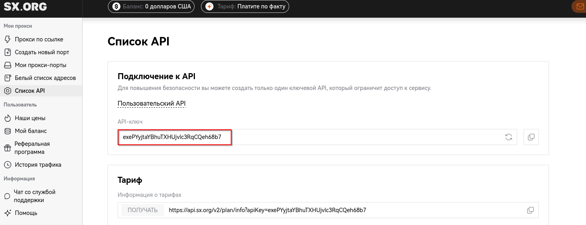

Вы можете найти свой API-ключ в разделе **«Настройки»**, затем перейти в **«Список API»**, где будет отображен ключ, доступный для использования.



Вы можете использовать свой API для того, чтобы интегрировать его в собственные приложения, автоматизировать задачи, взаимодействовать с нашим сервисом или получать доступ к данным, предоставляемым нашей платформой.

----

Вот пример кода на **Python**, демонстрирующий использование **API** для создания прокси.

```python
import requests
import json

API_KEY = 'YourApiKey'
url = f'https://api.sx.org/v2/proxy/create-port?apiKey={API_KEY}'

data = {
    'country_code': 'US',
    'state': 'District of Columbia',
    'city': 'Washington',
    'type_id': 1,  # 1: KEEP PROXY, 2: KEEP_CONNECTION, 3: ROTATE CONNECTION
    'proxy_type_id': 2,  # 1: RESIDENTIAL, 2: ALL, 3: MOBILE, 4: CORPORATE
    'name': 'My Proxy',
    'server_port_type_id': 0,  # 0: SHARED, 1: DEDICATED
    'count': 1
}

headers = {
    'Content-Type': 'application/json',
    'Accept': 'application/json'
}

response = requests.post(url, headers=headers, data=json.dumps(data))

try:
    response_data = response.json()
    print('Response:', response_data)
except ValueError:
    print('Error: Failed to decode JSON response')
```

---

Чтобы отправить запрос, не обязательно использовать языки программирования. Можно воспользоваться любыми удобными инструментами, такими как **cURL**, **Burp Suite**, **Postman** и другие.

Вы можете использовать наш API для интеграции нашего продукта в ваше приложение любым удобным для вас способом.

Например: Для просмотра тарифа с использованием **cURL** запроса вы можете выполнить следующий запрос к нашему API:

```bash
curl https://api.sx.org/v2/plan/info\?apiKey\=exePYyjtaYBhuTXHUjvlc3RqCQeh68b7 | jq
```

С помощью этой команды мы отправили HTTP-запрос на получение информации о плане (тарифе) через **API** с использованием **curl** и обработали результат с помощью утилиты **jq**. Мы использовали **jq** для того, чтобы удобно обработать и отформатировать ответ от API в формате **JSON**. Без **jq** ответ от API будет представлен в сыром виде, который может быть трудным для восприятия. **jq** помогает извлечь нужную информацию и отобразить её в более читаемом и структурированном формате, что облегчает работу с данными.

```
 % Total    % Received % Xferd  Average Speed   Time    Time     Time  Current  
                                Dload  Upload   Total   Spent    Left  Speed  
100   531    0   531    0     0   1208      0 --:--:-- --:--:-- --:--:--  1209  
{  
 "success": true,  
 "message": {  
   "expiredSeconds": 413045826,  
   "expiredDate": "2038-01-19 00:00:00",  
   "expiredTimestamp": 2147472000,  
   "elapsedDays": 4780,  
   "tariff": "Pay as you go",  
   "tariffName": "Pay as you go",  
   "traff": 0,  
   "urls": {  
     "all": "https://api.sx.org/api/v1/proxy-list/zTzXQMsfv97okjKLQ1rrYeHSZR3TIqMl.txt",  
     "residential": "https://api.sx.org/api/v1/proxy-list/zTzXQMsfv97okjKLQ1rrYeHSZR3TIqMl.txt?type%5B0%5D=residential",  
     "mobile": "https://api.sx.org/api/v1/proxy-list/zTzXQMsfv97okjKLQ1rrYeHSZR3TIqMl.txt?type%5B0%5D=mobile"  
   }  
 }  
}
```


Чтобы отправить запрос для просмотра пользовательского баланса, вам нужно использовать HTTP-запрос к соответствующему API-эндпоинту. Этот запрос включает передачу вашего уникального API-ключа, который аутентифицирует вас на платформе и предоставляет доступ к необходимой информации. После того как запрос отправлен, вы получаете ответ в формате JSON, содержащий информацию о балансе пользователя. Чтобы этот ответ было проще воспринимать, можно использовать инструменты, такие как **jq**, которые позволяют отформатировать и удобно вывести данные для чтения.

```bash
curl https://api.sx.org/v2/plan/info\?apiKey\=exePYyjtaYBhuTXHUjvlc3RqCQeh68b7 | jq	

```

Результат отправки запроса для просмотра пользовательского баланса будет содержать информацию, которая возвращается API

```
% Total    % Received % Xferd  Average Speed   Time    Time     Time  Current  
                                Dload  Upload   Total   Spent    Left  Speed  
100   531    0   531    0     0   1208      0 --:--:-- --:--:-- --:--:--  1209  
{  
 "success": true,  
 "message": {  
   "expiredSeconds": 413045826,  
   "expiredDate": "2038-01-19 00:00:00",  
   "expiredTimestamp": 2147472000,  
   "elapsedDays": 4780,  
   "tariff": "Pay as you go",  
   "tariffName": "Pay as you go",  
   "traff": 0,  
   "urls": {  
     "all": "https://api.sx.org/api/v1/proxy-list/zTzXQMsfv97okjKLQ1rrYeHSZR3TIqMl.txt",  
     "residential": "https://api.sx.org/api/v1/proxy-list/zTzXQMsfv97okjKLQ1rrYeHSZR3TIqMl.txt?type%5B0%5D=residential",  
     "mobile": "https://api.sx.org/api/v1/proxy-list/zTzXQMsfv97okjKLQ1rrYeHSZR3TIqMl.txt?type%5B0%5D=mobile"  
   }  
 }  
}
```

 Вы можете найти список доступных API в разделе **«Настройки»** -> **«Список API»**. В этом разделе отображаются все доступные API, их описания и параметры, которые можно использовать для интеграции с вашим приложением или сервисом.


